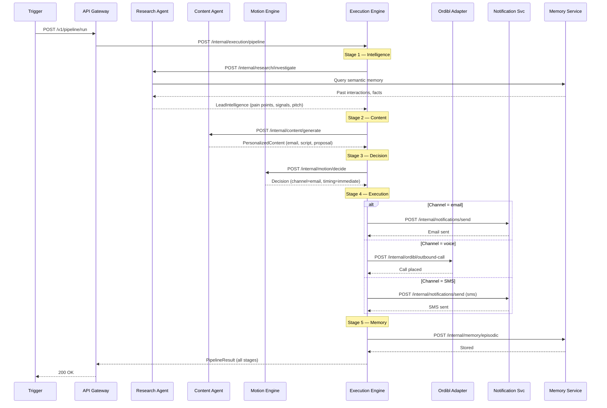
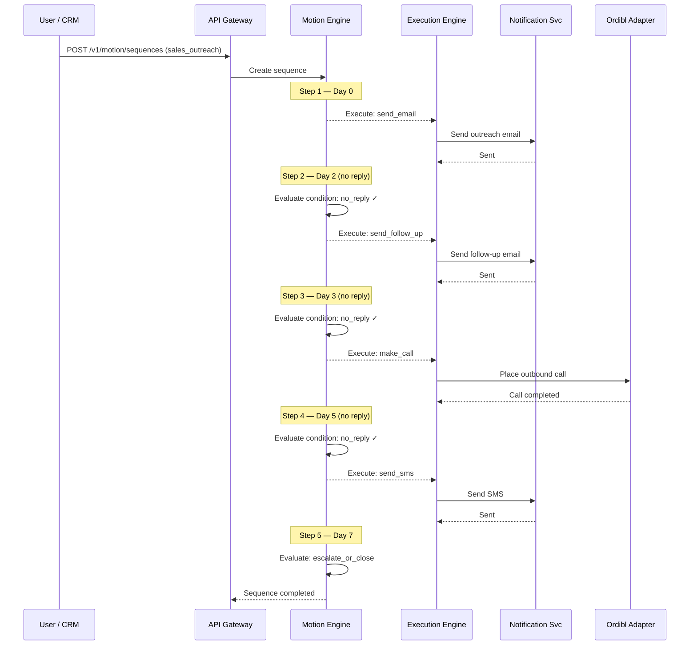
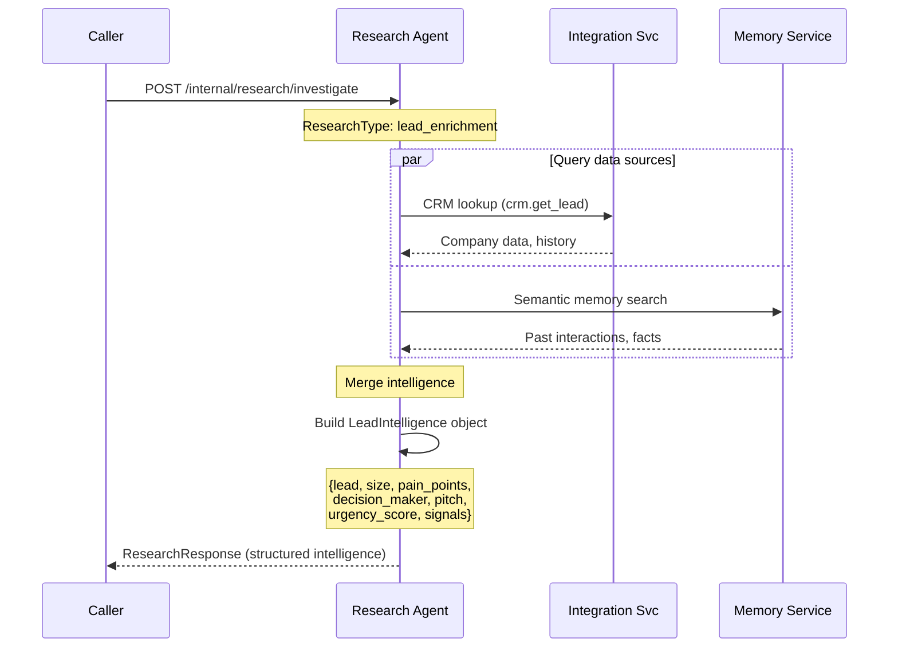
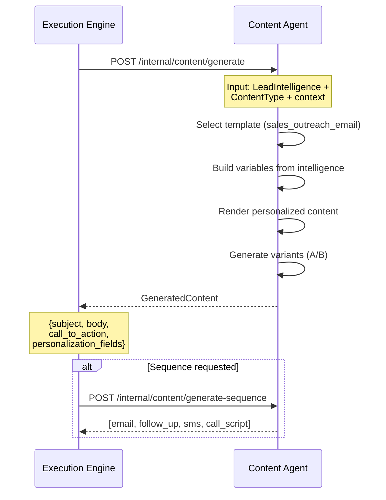

# Cognitive → Execution Stack — Pipeline Diagrams

## Full Pipeline Sequence



## Sales Outreach Motion Sequence



## Research Agent Intelligence Flow



## Content Generation Flow



## Architecture Layers

```
┌─────────────────────────────────────────────────────────┐
│                   THINKING LAYER                         │
│                                                          │
│  ┌─────────────────┐    ┌─────────────────┐             │
│  │ Research Agent   │───>│ Content Agent    │             │
│  │ :8010            │    │ :8011            │             │
│  │                  │    │                  │             │
│  │ • Lead enrich    │    │ • Email gen      │             │
│  │ • Market research│    │ • Call scripts   │             │
│  │ • Competitors    │    │ • Proposals      │             │
│  │ • Signal detect  │    │ • SMS / follow-up│             │
│  └─────────────────┘    └────────┬─────────┘             │
├──────────────────────────────────┼───────────────────────┤
│              DECISION & PLANNING LAYER                   │
│                                  │                       │
│              ┌───────────────────▼──────────┐            │
│              │     Motion Engine :8012       │            │
│              │                              │            │
│              │  • When to act               │            │
│              │  • Which channel             │            │
│              │  • Sequence steps            │            │
│              │  • SLA + retry rules         │            │
│              └──────────────┬───────────────┘            │
├─────────────────────────────┼────────────────────────────┤
│                   EXECUTION LAYER                        │
│                             │                            │
│              ┌──────────────▼───────────────┐            │
│              │   Execution Engine :8013      │            │
│              │                              │            │
│              │  • Send email                │            │
│              │  • Make call (Ordibl)        │            │
│              │  • Update CRM               │            │
│              │  • Create invoice            │            │
│              │  • Schedule meeting          │            │
│              └──────────────┬───────────────┘            │
├─────────────────────────────┼────────────────────────────┤
│                INFRASTRUCTURE LAYER                      │
│                             │                            │
│  ┌──────────┐  ┌───────────▼──┐  ┌───────────┐          │
│  │ Memory   │  │ Ordibl Voice │  │ CRM /     │          │
│  │ Service  │  │ Infrastructure│  │ Payments  │          │
│  └──────────┘  └──────────────┘  └───────────┘          │
└─────────────────────────────────────────────────────────┘
```
