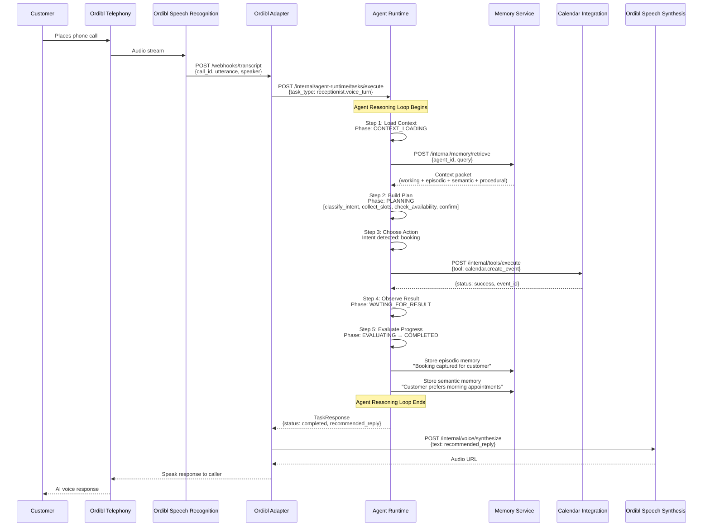
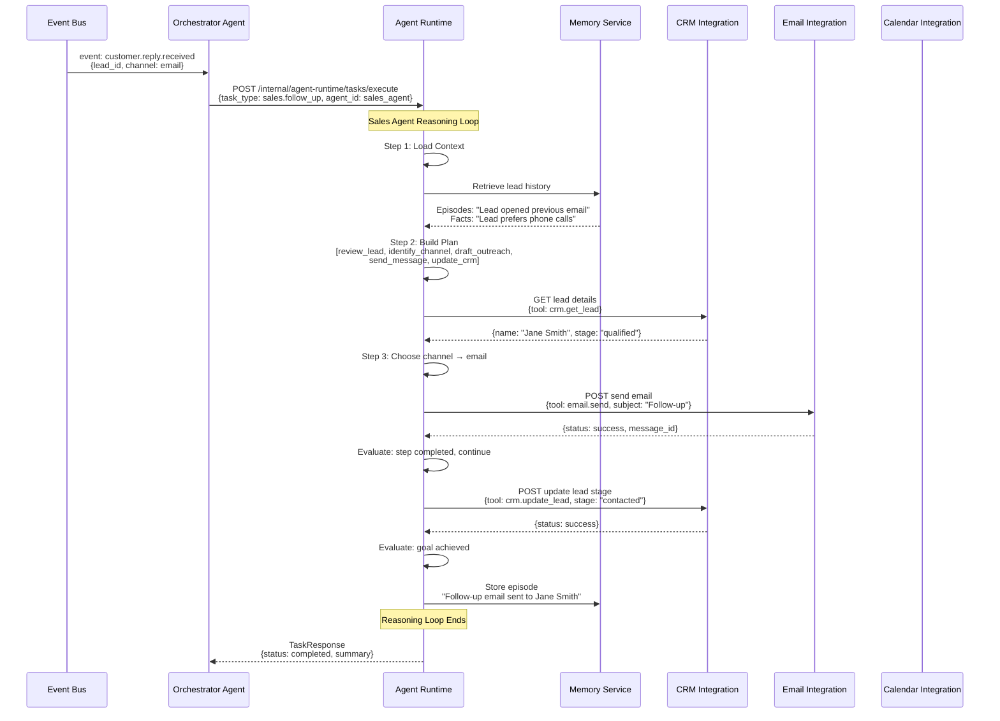
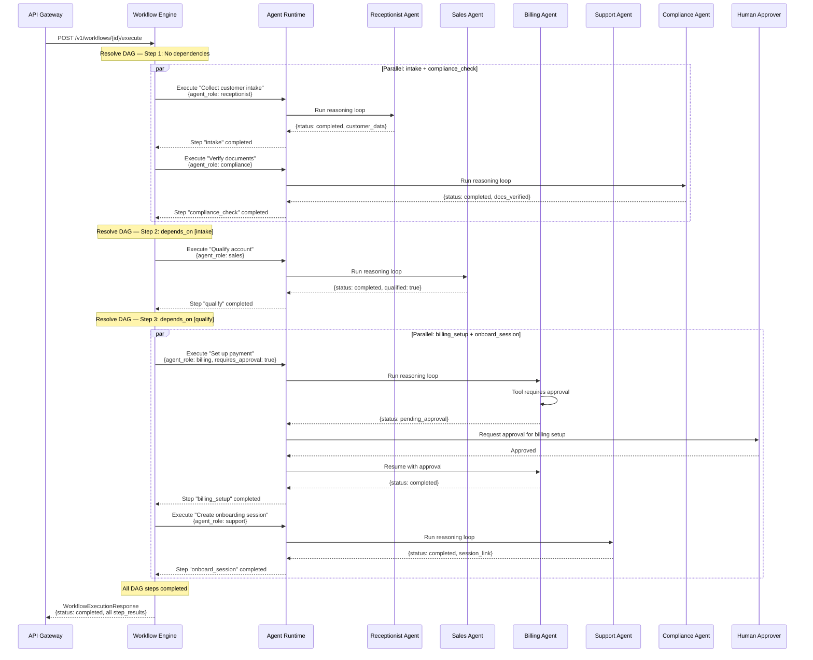
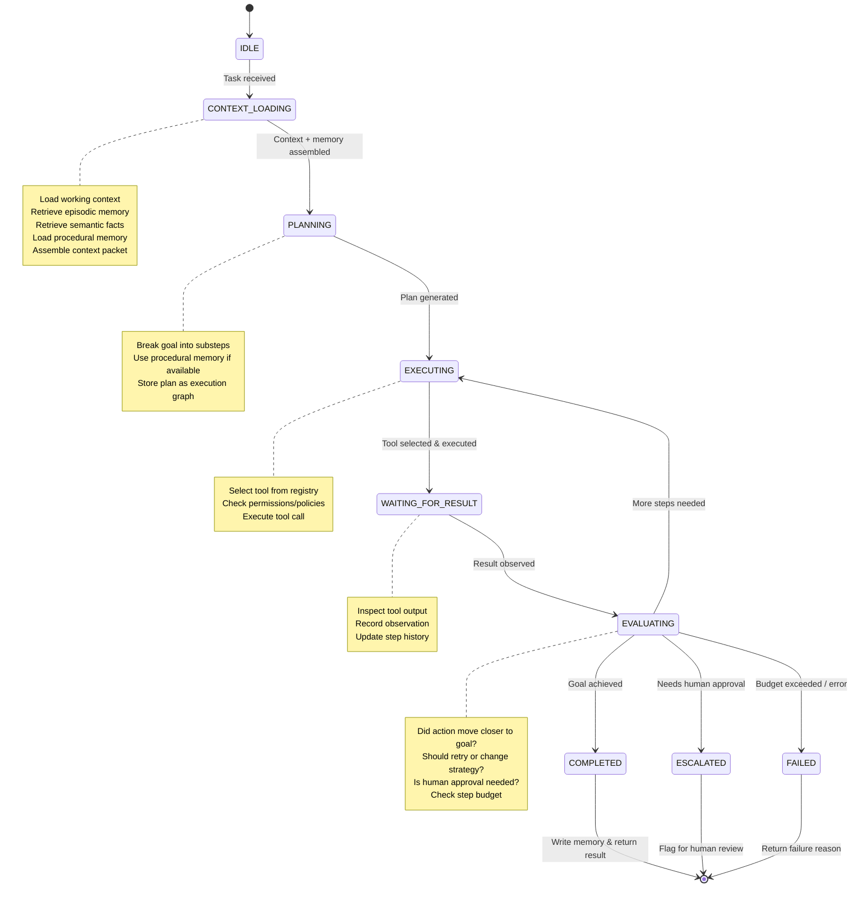
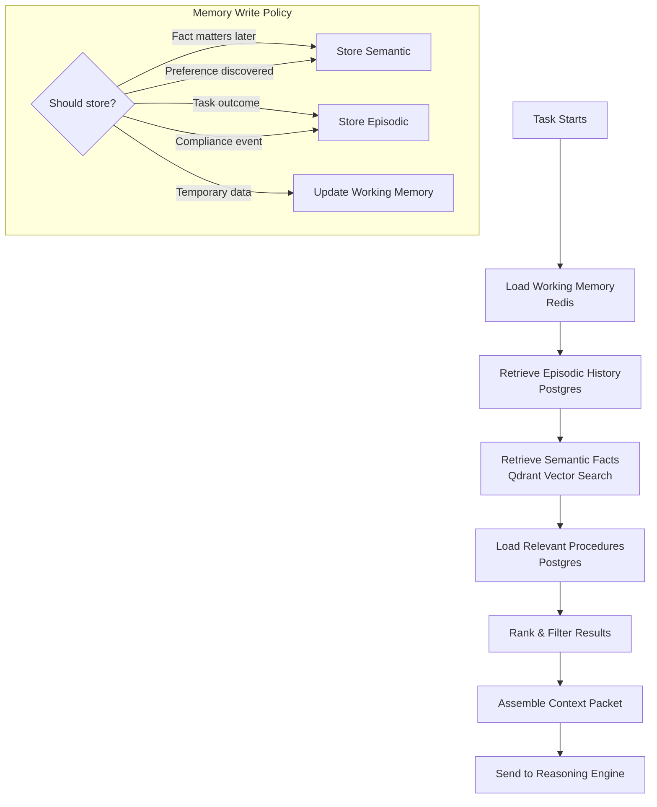
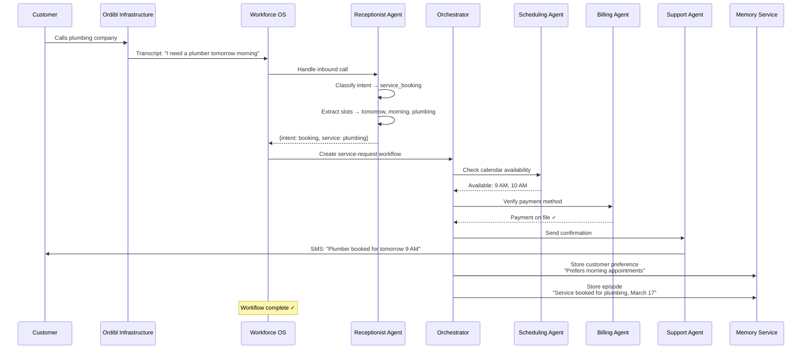

# Sequence Diagrams — Aivira Workforce OS

## A. Inbound Voice Call → Receptionist Agent → Scheduling

## B. Sales Lead Follow-Up Agent

## C. Multi-Agent Orchestration — Customer Onboarding Workflow

## D. Agent Reasoning Loop — Internal State Machine

## E. Memory Retrieval Pipeline

## F. End-to-End Flow — Plumbing Company Example

