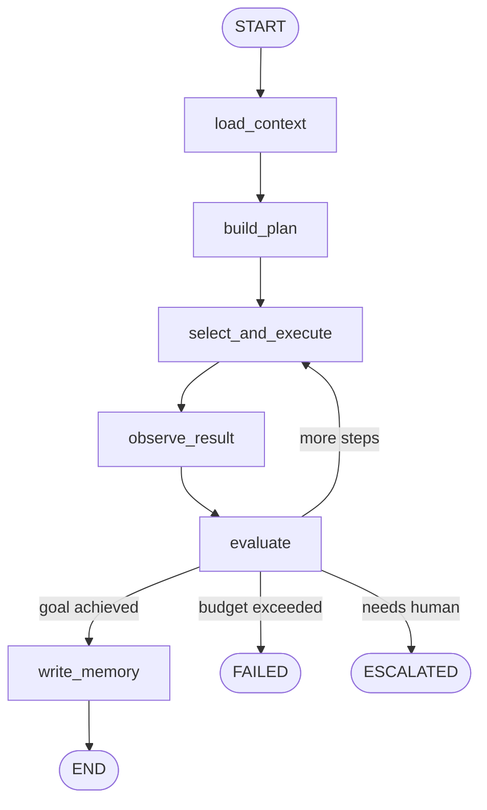

# LangGraph Flow Definitions — Aivira Workforce OS

## Overview

The Agent Runtime uses **LangGraph** to implement the reasoning loop
as a compiled state graph.  Each node corresponds to a phase of the
agent reasoning cycle.

## Agent State

```python
class AgentState(TypedDict):
    task_id: str
    organization_id: str
    agent_id: str
    goal: str
    input: dict
    constraints: dict
    success_criteria: list[str]

    # Mutable state updated by nodes
    context: dict          # assembled memory context
    plan: list[dict]       # generated substeps
    current_step_index: int
    step_history: list[dict]
    status: str            # IDLE → CONTEXT_LOADING → ... → COMPLETED
    result: dict
    failure_reason: str
    max_steps: int
```

## Graph Topology



## Node Definitions

### 1. `load_context`

```python
def load_context(state: AgentState) -> AgentState:
    """
    Phase: CONTEXT_LOADING

    Calls Memory Service to assemble a context packet:
      - Working memory (Redis) — current session state
      - Episodic memory (Postgres) — past task experiences
      - Semantic memory (Qdrant) — general facts & knowledge
      - Procedural memory (Postgres) — playbooks/SOPs

    POST /internal/memory/retrieve
    {
      organization_id, agent_id,
      query: <goal>,
      memory_types: [working, episodic, semantic, procedural]
    }

    Updates state.context with assembled packet.
    """
```

### 2. `build_plan`

```python
def build_plan(state: AgentState) -> AgentState:
    """
    Phase: PLANNING

    Uses the LLM to break the goal into substeps based on:
      - The goal text
      - Assembled context
      - Available tools
      - Procedural memory (if a matching SOP exists)

    Output: list of plan steps, e.g.:
    [
      {"step": "classify_intent", "description": "..."},
      {"step": "check_calendar", "description": "..."},
      {"step": "book_appointment", "description": "..."},
      {"step": "confirm_with_customer", "description": "..."}
    ]

    The plan is stored in state.plan and can be re-planned
    during evaluation if the agent determines a change in
    strategy is needed.
    """
```

### 3. `select_and_execute`

```python
def select_and_execute(state: AgentState) -> AgentState:
    """
    Phase: EXECUTING

    Picks the next step from the plan and selects the appropriate
    tool from the agent's tool registry.

    Tool execution flow:
      1. Read current plan step
      2. Match to available tool (calendar.create_event, crm.update_lead, etc.)
      3. Build tool input from state + context
      4. POST /internal/tools/execute {tool_name, parameters}
      5. Record tool output in step_history

    If no tool is needed (pure reasoning step), the LLM generates
    the output directly.
    """
```

### 4. `observe_result`

```python
def observe_result(state: AgentState) -> AgentState:
    """
    Phase: WAITING_FOR_RESULT

    Inspects the output of the last action:
      - Was the tool call successful?
      - What data was returned?
      - Did an error occur?

    Records an observation string in the step history.
    This observation is fed back into the next evaluation
    or execution step.
    """
```

### 5. `evaluate`

```python
def evaluate(state: AgentState) -> AgentState:
    """
    Phase: EVALUATING

    The critical reflection step. The agent (or a separate
    evaluator model) answers:

      1. Did this action move closer to the goal?
      2. Are success_criteria partially/fully met?
      3. Should the agent retry, change strategy, or escalate?
      4. Has the step budget been exceeded?
      5. Is human approval required for the next action?

    Based on evaluation, sets state.status to one of:
      - "executing"   → loop back to select_and_execute
      - "completed"   → proceed to write_memory
      - "escalated"   → exit with human approval request
      - "failed"      → exit with failure reason
    """
```

### 6. `write_memory`

```python
def write_memory(state: AgentState) -> AgentState:
    """
    Phase: COMPLETED

    Stores important outcomes in memory:

    Episodic memory (what happened):
      POST /internal/memory/episodes
      { summary: "Booked appointment for customer", ... }

    Semantic memory (what was learned):
      POST /internal/memory/knowledge
      { fact_text: "Customer prefers morning meetings", ... }

    Working memory cleanup:
      DELETE /internal/memory/working/{session_id}

    Memory write policy — only store when:
      - Fact will likely matter later
      - Preference was discovered
      - Task outcome changed future behavior
      - Compliance event occurred
    """
```

## Conditional Edge Logic

```python
def should_continue(state: AgentState) -> str:
    """
    Determines the next node after evaluation.

    Returns:
      "select_and_execute" — more steps in plan
      "write_memory"       — goal achieved
      "escalated"          — needs human approval
      "failed"             — budget exceeded or error
    """
    if state["status"] == "completed":
        return "write_memory"
    if state["status"] == "escalated":
        return "escalated"
    if state["status"] == "failed":
        return "failed"
    if state["current_step_index"] >= state["max_steps"]:
        return "failed"  # budget exceeded
    return "select_and_execute"
```

## Graph Compilation

```python
from langgraph.graph import StateGraph, END

graph = StateGraph(AgentState)

# Add nodes
graph.add_node("load_context", load_context)
graph.add_node("build_plan", build_plan)
graph.add_node("select_and_execute", select_and_execute)
graph.add_node("observe_result", observe_result)
graph.add_node("evaluate", evaluate)
graph.add_node("write_memory", write_memory)

# Linear edges
graph.set_entry_point("load_context")
graph.add_edge("load_context", "build_plan")
graph.add_edge("build_plan", "select_and_execute")
graph.add_edge("select_and_execute", "observe_result")
graph.add_edge("observe_result", "evaluate")

# Conditional branching from evaluate
graph.add_conditional_edges("evaluate", should_continue, {
    "select_and_execute": "select_and_execute",
    "write_memory": "write_memory",
    "escalated": END,
    "failed": END,
})

graph.add_edge("write_memory", END)

compiled = graph.compile()
```

## Multi-Agent Extension

For multi-agent workflows, the **Workflow Engine** wraps this
single-agent graph:

```
Workflow Engine receives DAG of steps
  → For each ready step:
      → Resolve assigned agent
      → Create TaskRequest
      → POST to Agent Runtime
      → Agent Runtime runs its LangGraph loop
      → Returns TaskResponse
  → Workflow Engine checks dependencies
  → Dispatches next batch of ready steps
  → Repeat until DAG is fully resolved
```

The orchestrator pattern keeps agent-to-agent communication
**indirect** — agents never talk to each other directly.
All coordination flows through the Workflow Engine's task graph.
