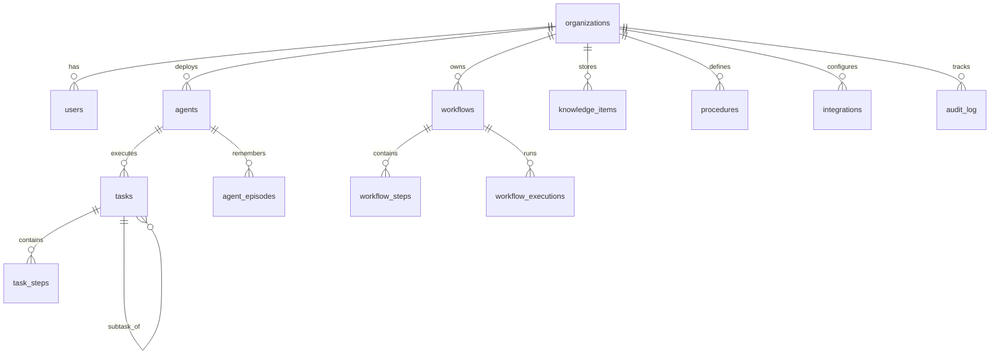

# Database Schema — Aivira Workforce OS

## Overview

All persistent data is stored in PostgreSQL with the following schema.
Vector embeddings for semantic memory are stored in Qdrant (or pgvector).
Working memory uses Redis for fast, ephemeral session state.

## Entity Relationship Diagram

## Tables

### organizations
| Column      | Type         | Constraints          | Description                |
|-------------|--------------|----------------------|----------------------------|
| id          | UUID         | PK, default uuid4    | Tenant identifier          |
| name        | VARCHAR(256) | NOT NULL             | Organization name          |
| slug        | VARCHAR(128) | UNIQUE, NOT NULL     | URL-friendly identifier    |
| industry    | VARCHAR(128) | NULLABLE             | Industry vertical          |
| timezone    | VARCHAR(64)  | NOT NULL, default UTC| Org timezone               |
| settings    | JSONB        | NOT NULL, default {} | Org-level configuration    |
| is_active   | BOOLEAN      | NOT NULL, default T  | Soft delete flag           |
| created_at  | TIMESTAMP    | NOT NULL             | Creation timestamp         |
| updated_at  | TIMESTAMP    | NOT NULL             | Last update timestamp      |

### users
| Column          | Type         | Constraints          | Description              |
|-----------------|--------------|----------------------|--------------------------|
| id              | UUID         | PK                   | User identifier          |
| organization_id | UUID         | FK → organizations   | Tenant ownership         |
| email           | VARCHAR(320) | UNIQUE, NOT NULL     | Login email              |
| hashed_password | VARCHAR(256) | NOT NULL             | bcrypt hash              |
| full_name       | VARCHAR(256) | NOT NULL             | Display name             |
| role            | VARCHAR(64)  | NOT NULL             | admin / member / viewer  |
| is_active       | BOOLEAN      | NOT NULL, default T  | Account active flag      |
| created_at      | TIMESTAMP    | NOT NULL             | Creation timestamp       |
| updated_at      | TIMESTAMP    | NOT NULL             | Last update timestamp    |

### agents
| Column             | Type         | Constraints          | Description                   |
|--------------------|--------------|----------------------|-------------------------------|
| id                 | UUID         | PK                   | Agent identifier              |
| organization_id    | UUID         | FK → organizations   | Tenant ownership              |
| name               | VARCHAR(256) | NOT NULL             | Agent display name            |
| role               | VARCHAR(128) | NOT NULL             | receptionist/sales/support/.. |
| description        | TEXT         | NULLABLE             | Agent description             |
| status             | ENUM         | NOT NULL             | idle/busy/error/disabled      |
| capabilities       | TEXT[]       | NOT NULL             | Capability tags               |
| tools              | TEXT[]       | NOT NULL             | Allowed tool names            |
| policies           | JSONB        | NOT NULL             | Permission & behavior rules   |
| max_steps          | INTEGER      | NOT NULL, default 20 | Step budget per task          |
| max_tokens_per_step| INTEGER      | NOT NULL             | Token budget per step         |
| timeout_seconds    | INTEGER      | NOT NULL             | Task timeout                  |
| created_at         | TIMESTAMP    | NOT NULL             | Creation timestamp            |
| updated_at         | TIMESTAMP    | NOT NULL             | Last update timestamp         |

**Indexes:** `(organization_id, role)`

### tasks
| Column           | Type         | Constraints           | Description                  |
|------------------|--------------|-----------------------|------------------------------|
| id               | UUID         | PK                    | Task identifier              |
| organization_id  | UUID         | FK → organizations    | Tenant ownership             |
| agent_id         | UUID         | FK → agents           | Assigned agent               |
| parent_task_id   | UUID         | FK → tasks, NULLABLE  | Parent task (sub-tasks)      |
| task_type        | VARCHAR(128) | NOT NULL              | e.g. receptionist.voice_turn |
| goal             | TEXT         | NOT NULL              | Natural language goal        |
| input            | JSONB        | NOT NULL              | Task input data              |
| constraints      | JSONB        | NOT NULL              | Execution constraints        |
| success_criteria | TEXT[]       | NOT NULL              | Completion criteria          |
| status           | ENUM         | NOT NULL              | Full state machine status    |
| result           | JSONB        | NOT NULL              | Task result                  |
| plan             | JSONB        | NOT NULL              | Generated execution plan     |
| steps_executed   | INTEGER      | NOT NULL, default 0   | Steps completed              |
| priority         | INTEGER      | NOT NULL, default 5   | 1 (highest) to 10 (lowest)   |
| deadline         | TIMESTAMP    | NULLABLE              | Optional deadline            |
| failure_reason   | TEXT         | NULLABLE              | Why task failed              |
| started_at       | TIMESTAMP    | NULLABLE              | When execution began         |
| completed_at     | TIMESTAMP    | NULLABLE              | When execution ended         |
| created_at       | TIMESTAMP    | NOT NULL              | Creation timestamp           |
| updated_at       | TIMESTAMP    | NOT NULL              | Last update timestamp        |

**Indexes:** `(organization_id, status)`, `(agent_id, status)`

### task_steps
| Column      | Type         | Constraints          | Description              |
|-------------|--------------|----------------------|--------------------------|
| id          | UUID         | PK                   | Step identifier          |
| task_id     | UUID         | FK → tasks           | Parent task              |
| step_index  | INTEGER      | NOT NULL             | Execution order          |
| step_name   | VARCHAR(256) | NOT NULL             | Step label               |
| tool_used   | VARCHAR(256) | NULLABLE             | Tool that was called     |
| tool_input  | JSONB        | NOT NULL             | Input sent to tool       |
| tool_output | JSONB        | NOT NULL             | Output from tool         |
| observation | TEXT         | NOT NULL             | Agent's observation      |
| evaluation  | JSONB        | NOT NULL             | Reflection/eval result   |
| duration_ms | INTEGER      | NOT NULL             | Step duration            |
| created_at  | TIMESTAMP    | NOT NULL             | Step timestamp           |

**Constraints:** UNIQUE `(task_id, step_index)`

### workflows
| Column          | Type         | Constraints          | Description              |
|-----------------|--------------|----------------------|--------------------------|
| id              | UUID         | PK                   | Workflow identifier      |
| organization_id | UUID         | FK → organizations   | Tenant ownership         |
| name            | VARCHAR(256) | NOT NULL             | Workflow name            |
| description     | TEXT         | NULLABLE             | Description              |
| trigger_event   | VARCHAR(128) | NULLABLE             | Auto-trigger event type  |
| status          | ENUM         | NOT NULL             | Workflow status          |
| created_at      | TIMESTAMP    | NOT NULL             | Creation timestamp       |
| updated_at      | TIMESTAMP    | NOT NULL             | Last update timestamp    |

### workflow_steps
| Column              | Type         | Constraints           | Description              |
|---------------------|--------------|-----------------------|--------------------------|
| id                  | UUID         | PK                    | Step DB identifier       |
| workflow_id         | UUID         | FK → workflows        | Parent workflow          |
| step_id             | VARCHAR(128) | NOT NULL              | Logical step identifier  |
| name                | VARCHAR(256) | NOT NULL              | Step name                |
| assigned_agent_role | VARCHAR(128) | NOT NULL              | Agent role to execute    |
| depends_on          | TEXT[]       | NOT NULL              | Dependency step_ids      |
| input_schema        | JSONB        | NOT NULL              | Expected input shape     |
| expected_output     | JSONB        | NOT NULL              | Expected output shape    |
| timeout_seconds     | INTEGER      | NOT NULL              | Step timeout             |
| requires_approval   | BOOLEAN      | NOT NULL, default F   | Human approval gate      |
| created_at          | TIMESTAMP    | NOT NULL              | Creation timestamp       |

**Constraints:** UNIQUE `(workflow_id, step_id)`

### workflow_executions
| Column        | Type         | Constraints          | Description              |
|---------------|--------------|----------------------|--------------------------|
| id            | UUID         | PK                   | Execution identifier     |
| workflow_id   | UUID         | FK → workflows       | Parent workflow          |
| status        | ENUM         | NOT NULL             | Execution status         |
| current_step  | VARCHAR(128) | NULLABLE             | Currently active step    |
| step_results  | JSONB        | NOT NULL             | Results per step         |
| trigger_event | JSONB        | NULLABLE             | Event that triggered     |
| started_at    | TIMESTAMP    | NOT NULL             | Start time               |
| completed_at  | TIMESTAMP    | NULLABLE             | Completion time          |
| created_at    | TIMESTAMP    | NOT NULL             | Creation timestamp       |

**Indexes:** `(workflow_id, status)`

### agent_episodes (Episodic Memory)
| Column          | Type         | Constraints          | Description              |
|-----------------|--------------|----------------------|--------------------------|
| id              | UUID         | PK                   | Episode identifier       |
| agent_id        | UUID         | FK → agents          | Agent that experienced   |
| organization_id | UUID         | FK → organizations   | Tenant ownership         |
| task_id         | UUID         | FK → tasks, NULLABLE | Related task             |
| episode_type    | ENUM         | NOT NULL             | Type of episode          |
| summary         | TEXT         | NOT NULL             | Natural language summary |
| raw_event       | JSONB        | NOT NULL             | Full event payload       |
| participants    | TEXT[]       | NOT NULL             | Involved entities        |
| created_at      | TIMESTAMP    | NOT NULL             | When it happened         |

**Indexes:** `(organization_id, agent_id)`, `(created_at)`

### knowledge_items (Semantic Memory)
| Column           | Type         | Constraints          | Description              |
|------------------|--------------|----------------------|--------------------------|
| id               | UUID         | PK                   | Knowledge identifier     |
| organization_id  | UUID         | FK → organizations   | Tenant ownership         |
| entity_type      | VARCHAR(128) | NOT NULL             | customer/product/policy  |
| entity_id        | VARCHAR(256) | NULLABLE             | Related entity ID        |
| fact_text        | TEXT         | NOT NULL             | The knowledge fact       |
| metadata         | JSONB        | NOT NULL             | Additional metadata      |
| sensitivity      | ENUM         | NOT NULL             | Data classification      |
| retention_policy | ENUM         | NOT NULL             | How long to keep         |
| visibility       | VARCHAR(128) | NOT NULL             | Who can access           |
| created_at       | TIMESTAMP    | NOT NULL             | Creation timestamp       |
| updated_at       | TIMESTAMP    | NOT NULL             | Last update timestamp    |

**Indexes:** `(organization_id, entity_type)`

*Note: Vector embeddings stored in Qdrant collection `workforce_knowledge`
with the same UUID as primary key for cross-referencing.*

### procedures (Procedural Memory)
| Column          | Type         | Constraints          | Description              |
|-----------------|--------------|----------------------|--------------------------|
| id              | UUID         | PK                   | Procedure DB identifier  |
| organization_id | UUID         | FK → organizations   | Tenant ownership         |
| procedure_id    | VARCHAR(256) | NOT NULL             | Logical procedure ID     |
| name            | VARCHAR(256) | NOT NULL             | Procedure name           |
| trigger         | VARCHAR(256) | NOT NULL             | When to activate         |
| steps           | TEXT[]       | NOT NULL             | Ordered step names       |
| description     | TEXT         | NULLABLE             | Description              |
| version         | INTEGER      | NOT NULL, default 1  | Version number           |
| created_at      | TIMESTAMP    | NOT NULL             | Creation timestamp       |
| updated_at      | TIMESTAMP    | NOT NULL             | Last update timestamp    |

**Constraints:** UNIQUE `(organization_id, procedure_id, version)`
**Indexes:** `(trigger)`

### integrations
| Column                | Type         | Constraints          | Description              |
|-----------------------|--------------|----------------------|--------------------------|
| id                    | UUID         | PK                   | Integration identifier   |
| organization_id       | UUID         | FK → organizations   | Tenant ownership         |
| integration_type      | VARCHAR(128) | NOT NULL             | crm/calendar/billing/... |
| name                  | VARCHAR(256) | NOT NULL             | Display name             |
| credentials_encrypted | TEXT         | NULLABLE             | Encrypted credentials    |
| settings              | JSONB        | NOT NULL             | Configuration            |
| enabled               | BOOLEAN      | NOT NULL, default T  | Active flag              |
| created_at            | TIMESTAMP    | NOT NULL             | Creation timestamp       |
| updated_at            | TIMESTAMP    | NOT NULL             | Last update timestamp    |

**Indexes:** `(organization_id, integration_type)`

### audit_log
| Column          | Type         | Constraints          | Description              |
|-----------------|--------------|----------------------|--------------------------|
| id              | UUID         | PK                   | Log entry identifier     |
| organization_id | UUID         | FK → organizations   | Tenant ownership         |
| actor_type      | VARCHAR(64)  | NOT NULL             | user/agent/system        |
| actor_id        | VARCHAR(256) | NOT NULL             | Who performed action     |
| action          | VARCHAR(256) | NOT NULL             | What was done            |
| resource_type   | VARCHAR(128) | NOT NULL             | What was affected        |
| resource_id     | VARCHAR(256) | NOT NULL             | ID of affected resource  |
| details         | JSONB        | NOT NULL             | Additional details       |
| ip_address      | VARCHAR(64)  | NULLABLE             | Source IP                |
| created_at      | TIMESTAMP    | NOT NULL             | When it happened         |

**Indexes:** `(organization_id, created_at)`, `(resource_type, resource_id)`

*Note: This table is append-only. No UPDATE or DELETE operations allowed.*
